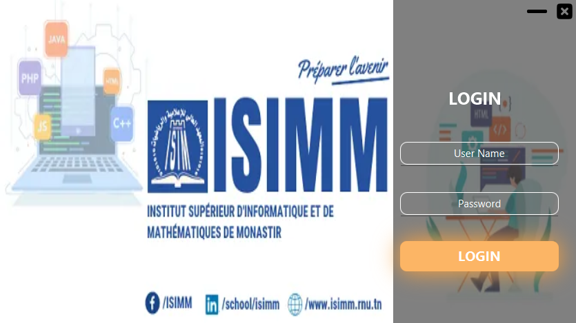
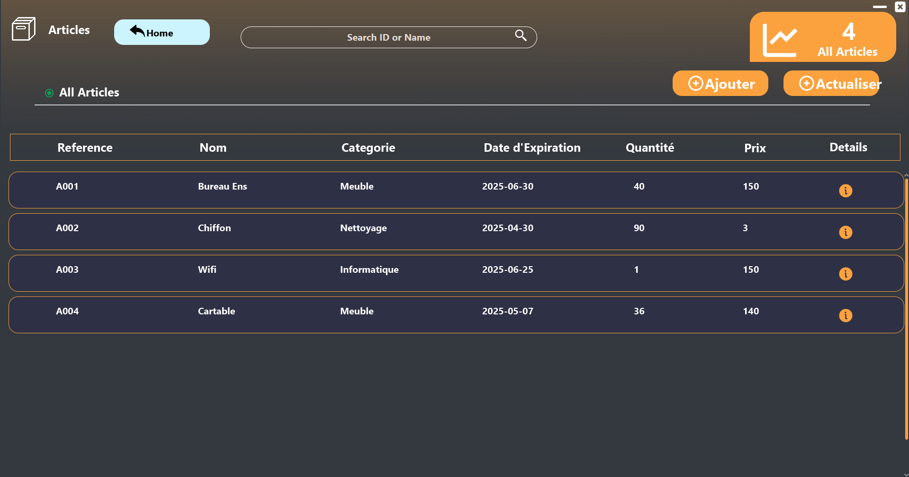
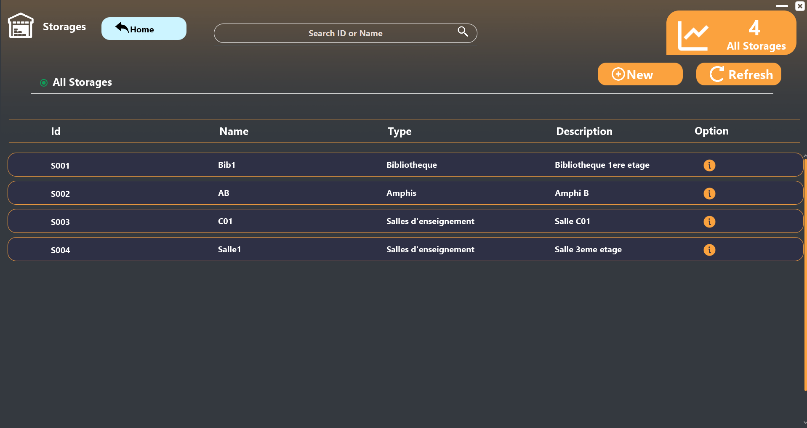
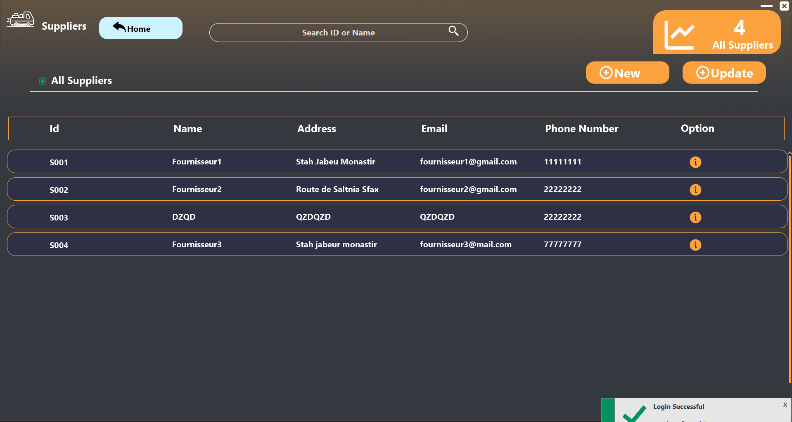
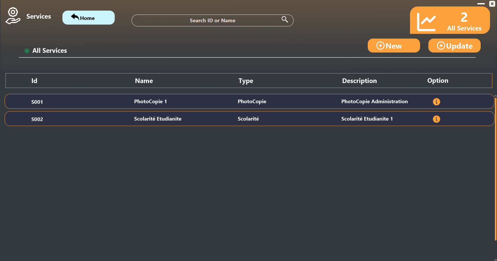
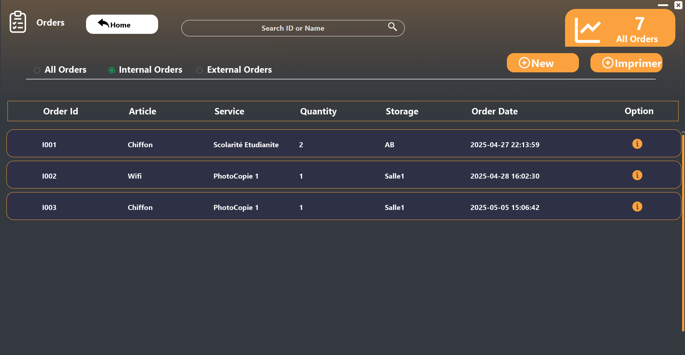
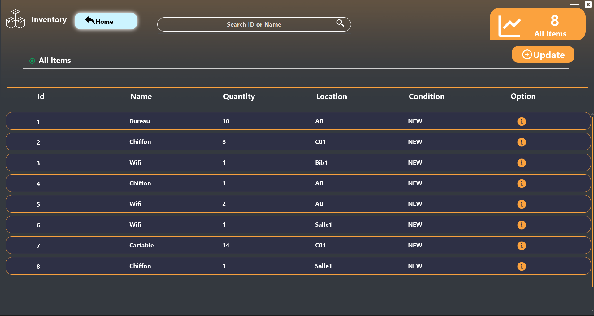

# 📦 JavaFX Stock Manager

A **desktop application** designed for efficient inventory tracking and order management, tailored for **ISIMM | Institut Supérieur d'Informatique et de Mathématiques de Monastir**. This project transforms classroom learning into a **practical stock management solution**.

---

## ✨ Features

- 📁 **Product & Category Management**  
  Add, edit, delete, and search product entries with category linking.

- 📦 **Order & Supplier Tracking**  
  Manage suppliers, track orders, and monitor stock levels in real-time.

- 🔍 **Smart Search & Filtering**  
  Quickly locate products or suppliers with advanced filtering and regex search.

- 📊 **Reports & Printing**  
  Generate PDF reports using JasperReports for inventory or purchase summaries.

- 🔄 **Live Updates**  
  Real-time interface updates ensure data accuracy and responsiveness.

---

## 🖼️ Screenshots

🏠 Main Interface

🧰 Entities

---

## 🎥 Demo Video

🎬 *Watch how the app works in real-time*  
👉 [Watch the video](https://www.linkedin.com/posts/yassin-medhioub-6a05aa212_javafx-inventorymanagement-studentproject-activity-7338971652392636416-Wfsj?utm_source=social_share_send&utm_medium=member_desktop_web&rcm=ACoAADXWTVgBrSW5LkeqY476dil9ccfS6_2mAtQ)

## 💼 Technical Details

- 👨‍💻 **Developer**: Yassin Medhioub 
- 🏢 **Institution**: ISIMM – Monastir  
- 🔧 **Built With**:
  - JavaFX + JFoenix (Modern UI Components)
  - Java
  - CSS
  - MySQL (Database)
  - JasperReports (PDF Reports)
  - Regex (Advanced Search)

---

## 📂 Data Storage

The application uses a MySQL database with tables for:

- `products`
- `categories`
- `suppliers`
- `storages`
- `orders`

---

## 📢 About the Project

> “This project emerged from a real need during a lab session at ISIMM. I aimed to design something practical and useful — now, it's a full-fledged inventory management system.”

---

